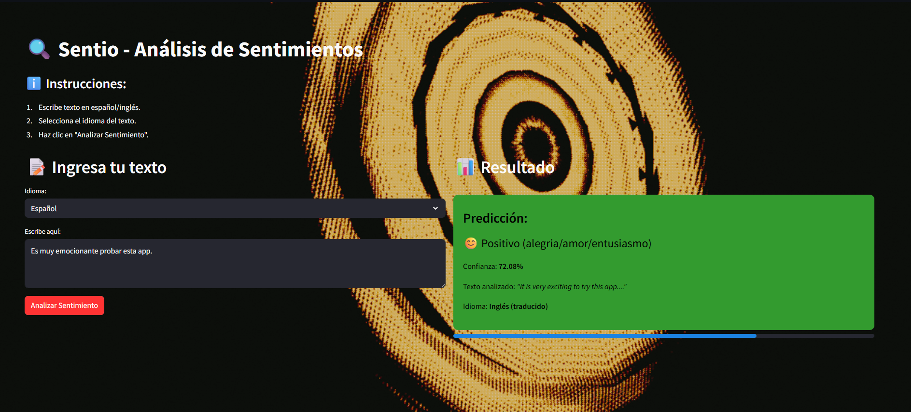
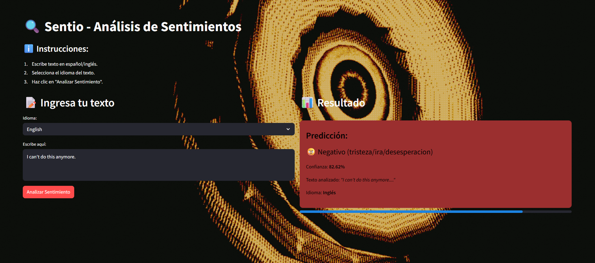

# Sentio – Análisis de Sentimientos en Tiempo Real

**Sentio** es una aplicación web interactiva que permite analizar el sentimiento de textos en español e inglés mediante un modelo de aprendizaje profundo. Clasifica el contenido como positivo, negativo o neutral, y muestra resultados con porcentaje de confianza. Incluye traducción automática para entradas en español.

> Enfoque en comprensión emocional de textos mediante procesamiento de lenguaje natural.

## Características

- Análisis de sentimientos en tiempo real
- Soporte para textos en español (con traducción automática) e inglés
- Visualización de resultados con porcentajes de confianza
- Interfaz simple compatible con móviles y escritorio

## Demo

Accede a la aplicación en:
[https://projectsentio.streamlit.app/](https://projectsentio.streamlit.app/)

## Capturas

